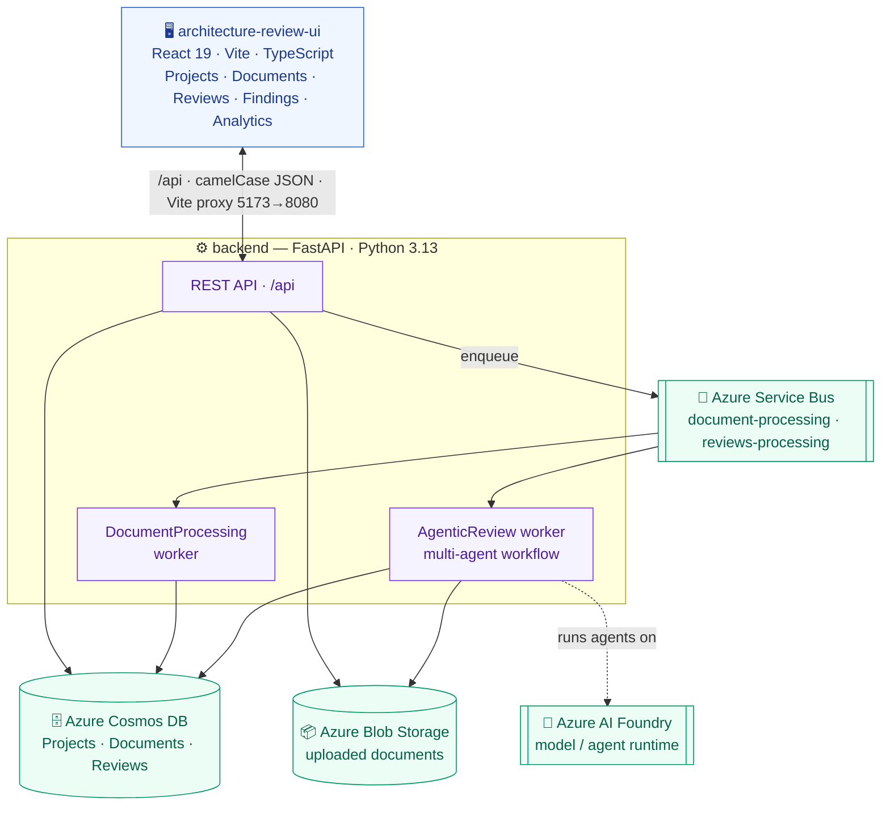
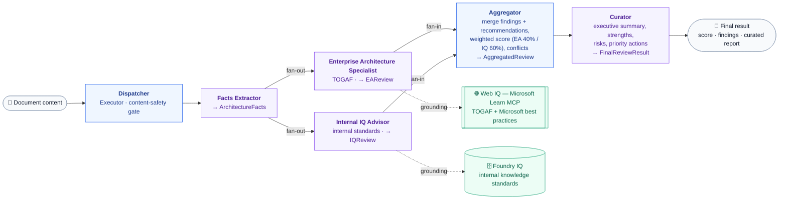

# Enterprise Architecture Advisor

A full-stack, cloud-native application for **AI-powered enterprise architecture reviews**. Users upload architecture documents; the system processes them asynchronously, runs an AI review against best practices, and surfaces scores, findings, and a curated report through an interactive dashboard.

This repository is split into **two independent applications** plus shared infrastructure. This root README is the map — each part has its own detailed README.

---

## Repository Layout

| Folder | What it is | README |
|--------|-----------|--------|
| [`backend/`](backend/) | Python **FastAPI** API + Azure services + background workers | [backend/README.md](backend/README.md) |
| [`architecture-review-ui/`](architecture-review-ui/) | **React 19 + TypeScript** single-page app | [architecture-review-ui/README.md](architecture-review-ui/README.md) |
| [`infra/`](infra/) | Infrastructure / provisioning assets | — |

### Why the split?

The backend and UI are deliberately **decoupled** so they can be developed, tested, deployed, and scaled independently:

- **`backend/`** owns all business logic, data, and cloud integration. It talks to Azure Cosmos DB, Blob Storage, and Service Bus, and runs the workers that do document processing and AI review. It knows nothing about React.
- **`architecture-review-ui/`** is a pure presentation layer. It only knows the REST API contract (camelCase JSON DTOs) and renders it. It can run on its own (with graceful empty states) when the backend is offline.
- The contract between them is the **`/api` HTTP boundary** — in development the Vite dev server proxies `/api` to the backend, and in production they can be hosted separately (e.g. Static Web App + App Service).

If you're working on data, models, queues, or Azure access → go to **`backend/`**.
If you're working on screens, components, styling, or UX → go to **`architecture-review-ui/`**.

---

## How It Fits Together

### System architecture



> Blue = React UI · purple = FastAPI backend (API + two background workers) · green = Azure managed services. Solid arrows = data/control flow; dotted = the agent workflow running on Azure AI Foundry.

**End-to-end flow (after a document upload):**

1. UI uploads a file → `POST /api/project/{id}/documents`.
2. Backend stores the blob, creates a `Document` (status `Pending`), and queues a message.
3. The **document-processing** worker extracts/classifies content, then queues a review.
4. The **agentic-review** worker runs a **multi-agent review workflow** (Microsoft Agent Framework on Azure AI Foundry) → score, findings, and a curated report → persists a `Review`. See [backend/README.md](backend/README.md#agent-orchestration--microsoft-agent-framework-on-azure-ai-foundry).
5. The UI polls for updates; the document moves to `Completed` and the report becomes viewable.

A more detailed walkthrough lives in [backend/README.md](backend/README.md#data-processing-workflow).

### Agent review workflow

Step 4 above is a **graph of domain-specialized agents** built with the **Microsoft Agent Framework** and running on **Azure AI Foundry**. The facts extractor fans out to two specialists that run in parallel — each grounded by its own knowledge source — then their results fan in to the aggregator and are distilled by the curator.



> Blue = framework `Executor` · purple = LLM `Agent` · green = external grounding source · solid arrows = workflow edges · dotted = retrieval/grounding. Full detail in [backend/README.md](backend/README.md#agent-orchestration--microsoft-agent-framework-on-azure-ai-foundry).

---

## Quick Start

Run the two apps in separate terminals.

**1. Backend** (needs Azure resources + `az login`):
```bash
cd backend
python -m venv .venv && source .venv/bin/activate   # Windows: .venv\Scripts\activate
pip install -e .
az login
python main.py            # → http://127.0.0.1:8080  (docs at /docs)
```

**2. UI:**
```bash
cd architecture-review-ui
npm install
npm run dev               # → http://localhost:5173  (proxies /api to the backend)
```

The UI also runs standalone — without the backend, API calls fall back to empty states.

See each folder's README for full setup, configuration, and deployment details.

---

## Microsoft Best Practices (at a glance)

These are implemented in the backend; details in [backend/README.md](backend/README.md#security--microsoft-best-practices).

- **No API keys in code** — all Azure access uses `DefaultAzureCredential` (managed identity / `az login`), never keys or connection strings.
- **Strict RBAC** — the app identity gets least-privilege, resource-scoped role assignments (Cosmos Data Contributor, Storage Blob Data Contributor, Service Bus Sender/Receiver).
- **Local authentication disabled** — no shared-key/local auth; identity is handled by Entra ID / the platform.
- **Externalized configuration** — settings via Pydantic `BaseSettings` (env-driven), no secrets committed.

---

## License

MIT
